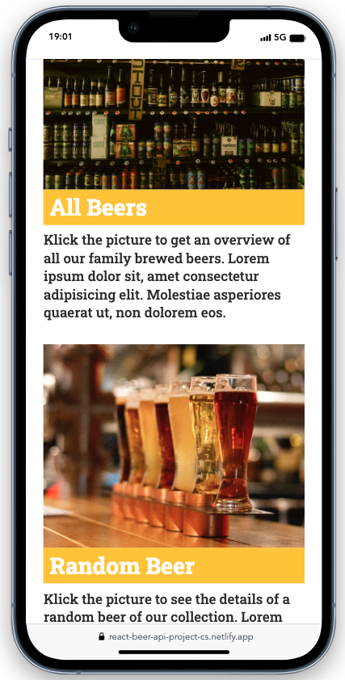
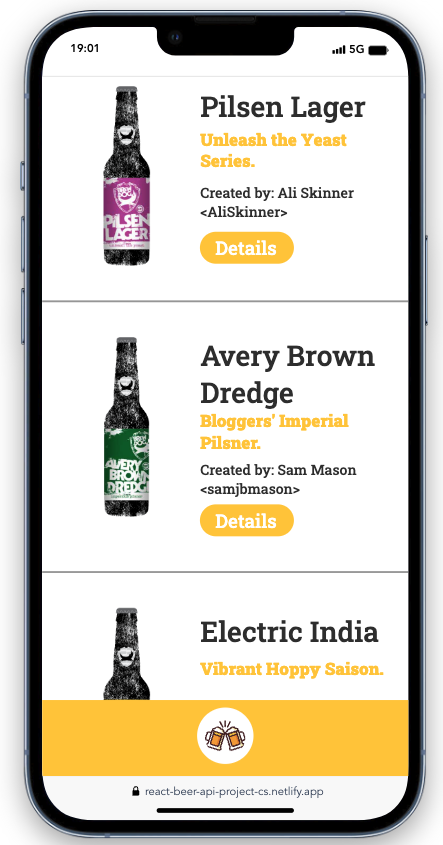
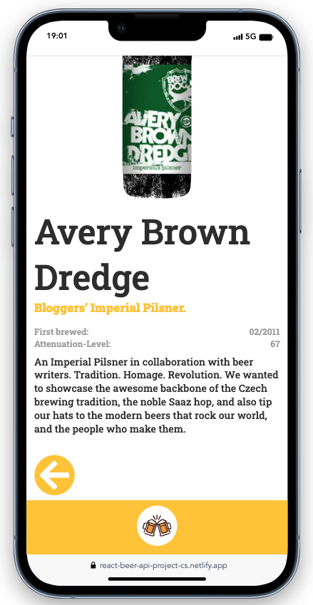

# Beer-API / React Project 🍻

- This project was created as part of a Full-Stack Webdeveloper bootcamp from supercode.

- The learning objective of the project:
- internalize the handling of useState- and useEffect-hooks in react
- the dynamic creation of detail pages using an API and the react npm package: react-router-dom

## How does the Beer-Website work?

- the website imitates a beer online store with a home page on which the user has two options:

1. the user can click on "all beers" and is redirected to an overview of all beers. If the user then clicks on the "Details" button, he is redirected to a detailed page of the beer, where he receives even more information about the beer
2. the user can click on "Random Beer" and will be forwarded directly to a detail page of a randomly selected beer.

- If the user clicks on the arrow, he is taken to the previous page.
- By clicking on the beer symbol in the nav bar below, the user is always taken to the home page

## Demo Link

https://react-beer-api-project-cs.netlify.app

## Screenshots 📸

## Copatible Screensizes

- optimized for mobile use but also usable on larger screens

## Tech Stack 💻

- react
- HTML
- SCSS
- vite
- GitHub
- netlify
- JavaScript
- GIT
- RESTful API (Beers API)

## Author 🤵‍♀️

- [@cecilestaller](https://github.com/cecilestaller)

## API-Links

https://ih-beers-api2.herokuapp.com/beers

https://ih-beers-api2.herokuapp.com/beers/random
